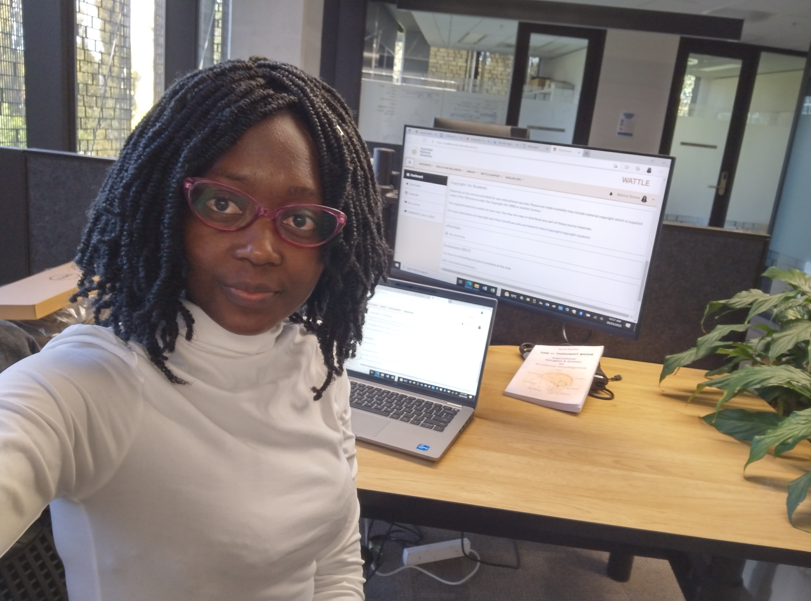

{:style="width:600px;"}
## About Me

I am PhD student at the Australian National University working on the formal verification of AI ethics principles in AI decision processess. I am hounoured to have in my supervisory panel Dr Alban Grastien, Pr Lexing Xie and Dr Muchael Norrish. I am interested 

---

## Research Interests

- **Fairness in AI** – auditing decision processes and mitigating structural bias  
- **Abductive reasoning** – generating formal explanations beyond counterfactual methods  
- **Explainable AI (XAI)** – making models transparent and accountable  

---

## Publications

- **Sonna, B.** (2024). *Explaining Why: A Formal Abductive Framework for Workplace-Driven Mental Health Decisions in Tech Environments*. _IJCAI Workshop_.  
- **Sonna, B.** (2023). *Formal Abductive Explanations for Navigating Mental Health Help-Seeking and Diversity in Tech Workplaces*. _NeurIPS Workshop_.  
- [Google Scholar Profile](https://scholar.google.com/) _(update with your link)_  

---

## Projects

- **Fairness Auditing Toolkit** – A framework for detecting proxy discrimination using formal abductive explanations.  
- **Workplace Mental Health AI Study** – Identifying structural features that justify why employees seek treatment.  
- **Ethics in AI Regulation** – Exploring how AI mirrors societal injustice and what human moral transformation is needed.

---

## Contact

- **Email:** your.email@anu.edu.au  
- **LinkedIn:** [linkedin.com/in/belona-sonna](https://www.linkedin.com/in/belona-sonna/)  
- **GitHub:** [github.com/your-username](https://github.com/your-username)

---

*This site is built with [GitHub Pages](https://pages.github.com/) using the Cayman theme.*
